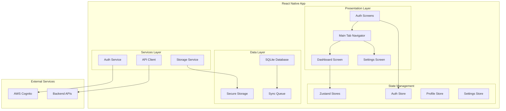

# Design Document - Sprint 1: Foundation

## Overview

Sprint 1 establishes the foundational architecture for the Raahi Android mobile application using React Native with Expo. The design focuses on creating a robust, offline-first foundation that supports secure authentication, efficient state management, and scalable component architecture. This foundation will support the driver's daily workflow with reliable offline capabilities, seamless synchronization, and proper Android system integration including background state preservation and permission management.

## Architecture

### High-Level Architecture



### Technology Stack

| Component | Technology | Rationale |
|-----------|------------|-----------|
| **Framework** | React Native 0.73+ with Expo | Cross-platform development with native performance |
| **Language** | TypeScript | Type safety and better developer experience |
| **State Management** | Zustand | Lightweight, simple, works well offline |
| **Navigation** | Expo Router | File-based routing, deep linking support |
| **Database** | SQLite (expo-sqlite) | Reliable offline storage |
| **HTTP Client** | Axios | Request/response interceptors, timeout handling |
| **Authentication** | AWS Amplify Auth | Cognito integration |
| **Secure Storage** | expo-secure-store | Android Keystore integration |
| **Build System** | EAS Build | Consistent Android builds |

## Components and Interfaces

### Authentication Flow Components

```typescript
// Auth Screen Components
interface LoginScreenProps {
  onPhoneSubmit: (phone: string) => Promise<void>;
  loading: boolean;
  error?: string;
}

interface OTPScreenProps {
  phone: string;
  onOTPSubmit: (otp: string) => Promise<void>;
  onResendOTP: () => Promise<void>;
  loading: boolean;
  error?: string;
  timeRemaining: number;
}

// Auth Service Interface
interface AuthService {
  requestOTP(phone: string): Promise<void>;
  verifyOTP(phone: string, otp: string): Promise<AuthTokens>;
  refreshToken(): Promise<AuthTokens>;
  logout(): Promise<void>;
  isAuthenticated(): boolean;
}
```

### UI Component System

```typescript
// Base UI Components
interface ButtonProps {
  variant: 'primary' | 'secondary' | 'outline' | 'ghost';
  size: 'small' | 'medium' | 'large';
  loading?: boolean;
  disabled?: boolean;
  onPress: () => void;
  children: React.ReactNode;
}

interface InputProps {
  type: 'text' | 'phone' | 'otp';
  value: string;
  onChangeText: (text: string) => void;
  placeholder?: string;
  error?: string;
  maxLength?: number;
  autoFocus?: boolean;
}

interface CardProps {
  variant: 'default' | 'elevated' | 'outlined';
  padding?: 'none' | 'small' | 'medium' | 'large';
  children: React.ReactNode;
}
```

### Navigation Structure

```typescript
// Navigation Types
type RootStackParamList = {
  '(auth)': undefined;
  '(main)': undefined;
  '(modals)': undefined;
};

type AuthStackParamList = {
  login: undefined;
  'otp-verify': { phone: string };
  onboarding: undefined;
};

type MainTabParamList = {
  index: undefined; // Dashboard
  'ai-chat': undefined;
  earnings: undefined;
  documents: undefined;
  settings: undefined;
};
```

## Data Models

### Authentication Models

```typescript
interface AuthTokens {
  accessToken: string;
  refreshToken: string;
  idToken: string;
  expiresAt: number;
}

interface DriverProfile {
  id: string;
  phone: string;
  name: string;
  licenseNumber: string;
  vehicleId?: string;
  status: 'active' | 'inactive' | 'suspended';
  shiftStatus: 'clocked_in' | 'clocked_out';
  clockedInAt?: string;
  totalHoursToday: number;
}
```

### Database Schema

```sql
-- Core tables for Sprint 1
CREATE TABLE drivers (
  id TEXT PRIMARY KEY,
  phone TEXT UNIQUE NOT NULL,
  name TEXT NOT NULL,
  license_number TEXT NOT NULL,
  vehicle_id TEXT,
  status TEXT NOT NULL DEFAULT 'active',
  shift_status TEXT NOT NULL DEFAULT 'clocked_out',
  clocked_in_at TEXT,
  total_hours_today REAL DEFAULT 0,
  created_at TEXT NOT NULL,
  updated_at TEXT NOT NULL
);

CREATE TABLE sync_queue (
  id TEXT PRIMARY KEY,
  operation TEXT NOT NULL, -- 'CREATE', 'UPDATE', 'DELETE'
  entity TEXT NOT NULL,    -- 'driver', 'shift', etc.
  payload TEXT NOT NULL,   -- JSON data
  priority INTEGER NOT NULL DEFAULT 2,
  retry_count INTEGER DEFAULT 0,
  max_retries INTEGER DEFAULT 3,
  created_at TEXT NOT NULL,
  last_attempt TEXT,
  error TEXT
);

CREATE TABLE app_settings (
  key TEXT PRIMARY KEY,
  value TEXT NOT NULL,
  updated_at TEXT NOT NULL
);
```

### State Management Design

```typescript
// Auth Store
interface AuthState {
  isAuthenticated: boolean;
  tokens: AuthTokens | null;
  profile: DriverProfile | null;
  loading: boolean;
  error: string | null;
  
  // Actions
  login: (phone: string, otp: string) => Promise<void>;
  logout: () => Promise<void>;
  refreshTokens: () => Promise<void>;
  updateProfile: (updates: Partial<DriverProfile>) => void;
  clockIn: () => Promise<void>;
  clockOut: () => Promise<void>;
}

// Settings Store
interface SettingsState {
  language: 'en' | 'hi' | 'ta' | 'te' | 'mr';
  theme: 'light' | 'dark' | 'system';
  notifications: boolean;
  offlineMode: boolean;
  
  // Actions
  updateSetting: <K extends keyof SettingsState>(key: K, value: SettingsState[K]) => void;
  loadSettings: () => Promise<void>;
  resetSettings: () => void;
}
```

## Error Handling

### Error Categories and Responses

```typescript
enum ErrorType {
  NETWORK_ERROR = 'NETWORK_ERROR',
  AUTH_ERROR = 'AUTH_ERROR',
  VALIDATION_ERROR = 'VALIDATION_ERROR',
  DATABASE_ERROR = 'DATABASE_ERROR',
  UNKNOWN_ERROR = 'UNKNOWN_ERROR'
}

interface AppError {
  type: ErrorType;
  message: string;
  code?: string;
  details?: any;
  timestamp: number;
}

// Error Handling Strategy
class ErrorHandler {
  static handle(error: AppError): void {
    switch (error.type) {
      case ErrorType.NETWORK_ERROR:
        // Queue for retry, show offline indicator
        break;
      case ErrorType.AUTH_ERROR:
        // Clear tokens, redirect to login
        break;
      case ErrorType.VALIDATION_ERROR:
        // Show user-friendly validation message
        break;
      case ErrorType.DATABASE_ERROR:
        // Log error, attempt recovery
        break;
      default:
        // Log error, show generic message
        break;
    }
  }
}
```

### Offline Error Handling

```typescript
interface SyncQueueItem {
  id: string;
  operation: 'CREATE' | 'UPDATE' | 'DELETE';
  entity: string;
  payload: any;
  priority: 1 | 2 | 3; // 1 = high, 3 = low
  retryCount: number;
  maxRetries: number;
  createdAt: number;
  lastAttempt?: number;
  error?: string;
}

class OfflineQueue {
  static async add(item: Omit<SyncQueueItem, 'id' | 'retryCount' | 'createdAt'>): Promise<void> {
    // Add to SQLite sync_queue table
  }
  
  static async process(): Promise<void> {
    // Process queued items when online
  }
  
  static async retry(itemId: string): Promise<void> {
    // Retry failed items with exponential backoff
  }
}
```

## Testing Strategy

### Unit Testing

```typescript
// Component Testing
describe('LoginScreen', () => {
  it('should validate phone number format', () => {
    // Test phone validation
  });
  
  it('should handle OTP request', async () => {
    // Test OTP flow
  });
  
  it('should show loading state', () => {
    // Test loading indicators
  });
});

// Store Testing
describe('AuthStore', () => {
  it('should authenticate user with valid OTP', async () => {
    // Test authentication flow
  });
  
  it('should handle token refresh', async () => {
    // Test token refresh
  });
  
  it('should clear state on logout', () => {
    // Test logout
  });
});
```

### Integration Testing

```typescript
// API Integration Tests
describe('AuthService', () => {
  it('should handle network errors gracefully', async () => {
    // Test offline scenarios
  });
  
  it('should queue failed requests', async () => {
    // Test sync queue
  });
});

// Database Tests
describe('SQLite Database', () => {
  it('should create tables on first run', async () => {
    // Test database initialization
  });
  
  it('should run migrations', async () => {
    // Test schema updates
  });
});
```

### Android-Specific Testing

- **Device Testing**: Test on various Android versions (API 21+)
- **Permission Testing**: Verify storage and network permissions
- **Background Testing**: Test app behavior when backgrounded
- **Memory Testing**: Monitor memory usage and leaks
- **Performance Testing**: Measure startup time and responsiveness

## Security Considerations

### Authentication Security

```typescript
// Secure Token Storage
class SecureTokenStorage {
  private static readonly TOKEN_KEY = 'auth_tokens';
  
  static async store(tokens: AuthTokens): Promise<void> {
    await SecureStore.setItemAsync(
      this.TOKEN_KEY,
      JSON.stringify(tokens),
      {
        keychainAccessible: SecureStore.WHEN_UNLOCKED,
        requireAuthentication: false
      }
    );
  }
  
  static async retrieve(): Promise<AuthTokens | null> {
    const stored = await SecureStore.getItemAsync(this.TOKEN_KEY);
    return stored ? JSON.parse(stored) : null;
  }
  
  static async clear(): Promise<void> {
    await SecureStore.deleteItemAsync(this.TOKEN_KEY);
  }
}
```

### Data Security

- **Database Encryption**: SQLite database encrypted at rest
- **Network Security**: All API calls over HTTPS
- **Input Validation**: Sanitize all user inputs
- **Error Logging**: No sensitive data in logs
- **Code Obfuscation**: Minify and obfuscate production builds

### Android Security Features

- **Android Keystore**: Use hardware-backed key storage when available
- **Network Security Config**: Configure certificate pinning
- **App Signing**: Use Android App Bundle with Play App Signing
- **ProGuard**: Enable code shrinking and obfuscation
- **Background State**: Preserve authentication state when app is backgrounded
- **Permission Management**: Proper Android permission declarations and runtime handling

## Performance Considerations

### Startup Performance

```typescript
// Lazy Loading Strategy
const LazyDashboard = lazy(() => import('../screens/Dashboard'));
const LazySettings = lazy(() => import('../screens/Settings'));

// Preload Critical Data
class AppInitializer {
  static async initialize(): Promise<void> {
    await Promise.all([
      this.initializeDatabase(),
      this.loadUserSettings(),
      this.checkAuthStatus()
    ]);
  }
}
```

### Memory Management

- **Image Optimization**: Use appropriate image sizes and formats
- **Component Cleanup**: Properly cleanup listeners and timers
- **State Optimization**: Minimize state updates and re-renders
- **Bundle Splitting**: Split code by feature/route

### Android Optimization

- **APK Size**: Use Android App Bundle for smaller downloads
- **Startup Time**: Optimize splash screen and initial render
- **Battery Usage**: Minimize background processing
- **Network Usage**: Implement efficient caching strategies
- **Background State Management**: Handle Android app lifecycle properly
- **Data Integrity**: Ensure SQLite data survives system app kills

## Implementation Notes

### Development Workflow

1. **Setup Phase**: Initialize project with Expo CLI
2. **Component Development**: Build UI components first
3. **State Integration**: Connect components to Zustand stores
4. **API Integration**: Implement authentication and profile APIs
5. **Database Setup**: Initialize SQLite with migrations
6. **Testing**: Unit and integration tests
7. **Android Testing**: Device testing and optimization

### Code Organization

```
src/
├── components/
│   ├── ui/           # Base UI components
│   └── auth/         # Auth-specific components
├── screens/
│   ├── auth/         # Authentication screens
│   └── main/         # Main app screens
├── stores/           # Zustand stores
├── services/         # API and external services
├── utils/            # Utility functions
├── types/            # TypeScript type definitions
└── constants/        # App constants
```

### Build Configuration

```json
// eas.json
{
  "build": {
    "development": {
      "developmentClient": true,
      "distribution": "internal"
    },
    "preview": {
      "distribution": "internal",
      "android": {
        "buildType": "apk"
      }
    },
    "production": {
      "android": {
        "buildType": "aab"
      }
    }
  }
}
```

This design provides a solid foundation for the Raahi Android application, focusing on reliability, security, and performance while maintaining the flexibility to add features in subsequent sprints.